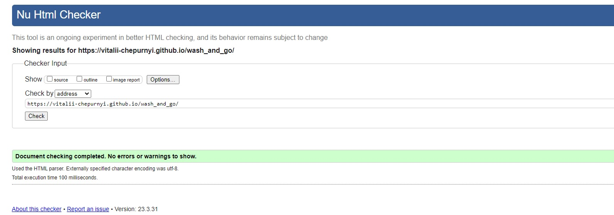

# Wash&Go
Wash&Go website is a platform that provides information and services related to the care and maintenance of 
pet's appearance and hygiene. The website is designed to help pet owners find a reliable and professional 
groomer for their pets and to learn about the various grooming services available.

Users of this website will be able to find all the information they need to know about Wash&Go services:
Their location, opening times, social media, online booking, services list, phone number to contact them directly
or contacting them online via text for people who are not comfortable with phone calls.
View live website [Wash&Go](https://vitalii-chepurnyi.github.io/wash_and_go/index.html)

# Features
<ul>
   <li>Navigation and Logo
      <ol>
       <li>Featured at the top of the page, the navigation shows the logo name Wash&Go in the left corner that links to home page.
       <li>The other navigation links are on the right hand corner: Home, Book Online, Contact which link to different pages.
       <li>It also changes it's appearance when you hover over it.
       <li>The navigation and logo contrast very well with background to give better visual look, and will be very easy to see and find.
       <li>The navigation clearly tells the user the name of grooming salon and makes different pages of information easy to find.
       </ol> 
</ul>

<ul>
   <li>The Homepage Image and Content
      <ol>
       <li>Homepage image shows different types of dogs.
       <li>Homepage content shows a slogan saying "All Pets Deserve Celebrity Care" it means that Wash&Go can work with different types of pets and ages.
       <li>Homepage book button that located under a slogan gives easy access for user to booking form located in book online page.
       <li>It also changes it's appearance when you hover over it.
       </ol> 
</ul>

<ul>
   <li>The Homepage, Our Vision Section
      <ol>
       <li>This section shows vision of Wash&Go and how they see their work to be perfect.
       <li>The vision section displays different types of methods they use to be as efficient and pet friendly as possible.
       <li>Also every header element features icons so the user can easily relate them to the topic.
       <li>It also changes it's appearance when you hover over it.
       </ol> 
</ul>

<ul>
   <li>The Homepage, Happy Customer Section
      <ol>
       <li>This section displays a video of a dog during his hair drying procedure.
       <li>A video have parameters set to autoplay so when the user enter a webpage he/she can see it straigh away.
       <li>The user can also control the video by skiping it or pause it.
       <li>It's muted during whole time to improve better user experiance.
       <li>This section shows a brief example of work Wash&Go provides.
       <li>This is done to out line the specific target of the website.
       </ol> 
</ul>

<ul>
   <li>Social Media
      <ol>
       <li>Social media Icons is available on all pages and it is fixed to the bottom of the page, so the user need to scroll down to see it.
       <li>Those icons link to the three most important social media pages for Wash&Go.
       <li>The links using special icons that are easy to spot and relate to specific social media. This is done to improve user experiance.
       <li>Also it has it's own header "Our Social Media" for user to spot it easily.
       <li>It also changes it's appearance when you hover over it.
       </ol> 
</ul>

<ul>
   <li>Footer
      <ol>
       <li>Footer is available on all pages and it is fixed to the bottom of the page, so the user need to scroll down to see it.
       <li>It contains only copyright information "©2023 by Wash&Go".
       <li>The position of copyright information is in the center of the page so the user can spot it easier.
       </ol> 
</ul>

<ul>
   <li>Book Online Page, Booking Form.
      <ol>
       <li>Booking form includes the name, email address, phone number and three options for the user to choose from.
       <li>The option the user can choose from is made by a radio button so it gives a clear understanding of selection.
       <li>The form cannot be submited if the user would not fill in all required fields, also if the email is not typed in correctly.
       <li>Booking form contains a "Book!" button for the user to clearly understand what it does.
       <li>It also changes it's appearance when you hover over it.
       <li>On the right side of the booking form you can see an image of a dog during his ear cleaning procedure, this is done to out line the specific target of the website.
       </ol>
</ul>

<ul>
   <li>Book Online Page, Prices.
      <ol>
       <li>The prices section provides information about the costs associated with a service.
       <li>The section includes three main positions: Delux, Platinum, Premium.
       <li>Delux position includes: bathing, brushing and combing, haircutting and styling.
       <li>Platinum position includes: bathing, brushing and combing, haircutting and styling, ear cleaning, teeth cleaning.
       <li>Premium position includes: bathing, brushing and combing, haircutting and styling, ear cleaning, teeth cleaning, flea and tick treatments, skin and coat treatments.
       <li>This section gives user more information about specific services Wash&Go provides, the names relate to radio buttons in the booking form.
       </ol>
</ul>

<ul>
   <li>Contact Page, Online message.
      <ol>
       <li>On the left hand side of the page you can see an image that displays a dog with pink heart glasses, it is done to make a page visually appealing.
       <li>Also on the right hand side a textarea is located with a header of "Send Us A Message!".
       <li>It's done for the people who don't really like to contact someone new by phone, so they can do it online.
       <li>Send Us A Message! textarea contains a "Send" button for the user to clearly understand what it does.
       <li>It also changes it's appearance when you hover over it.
       </ol>
</ul>

<ul>
   <li>Contact Page, Location, Phone Number, Opening Times.
      <ol>
       <li>This section contains all important information for the user to find and contact Wash&Go.
       <li>It is showing the opening times and the closing times, for the user to know when they can contact them or visit them.
       <li>The section located underneath of Online message section, it will be easy for the user to spot it there.
       <li>Our Location header contains icon for user to interact with. It changes it's appearance when you hover over it. And its linked to google maps location, so that the user can easily find the right place to go to. Its done to improve search for the business location.
       </ol>
</ul>

# Testing

<ul>
   <li>The website was viewed on all devices, including a desktop, laptop, tablet, and a few iPhone models.
   <li>This website has been viewed and tested on Google Chrome, Opera, Mozilla Firefox, Safari and Microsoft Edge.
   <li>Household members and frieds were asked to navigate through the website and identify any bugs or improvements to be made.
</ul>   

# Lighthouse Testing

# HTML Validator Testing

# CSS Validator Testing

# Deployment

<ul>
   <li>The website was deployed to GitHub. The steps to deploy are as follows:
      <ol>
       <li>In the GitHub repository, navigate to the Settings tab.
       <li>Scroll down to GitHub pages and click "Pages"
       <li>Under "Source" select "Deploy from branch"
       <li>Under "Branch" select "main" make sure to keep it in "/root"
       <li>Than press "Save" and the page will automatically build, and will show you the link once it was build.
       </ol>
</ul>

The live link is here --> [Wash&Go](https://vitalii-chepurnyi.github.io/wash_and_go/)

# Bugs

<ul>
    <li>Only one bug was detected when loading the website. In "Contact" page an image would not load. So to fix that I changed a file path to source. After that the image loaded in correctly.
</ul>    

# Credits
## Icons
   All the icons that is used on the website comes from Font Awesome. Here is the link to that website:
   https://fontawesome.com/search?q=gym&o=r&m=free

## Video
   Only one video was implemented in the website and it came from Shutterstock. Here is the link to that website: https://www.shutterstock.com/

## Images
   All featured images were borrowed from Pexels. Here is the link to that website: https://www.pexels.com/

## Links
   There are four links on the website leading to well known websites like Instagram, FaceBook, Twitter and Google Maps here is the link to those websites:

   https://www.instagram.com/

   https://www.facebook.com/

   https://twitter.com/?lang=en

   https://www.google.com/maps